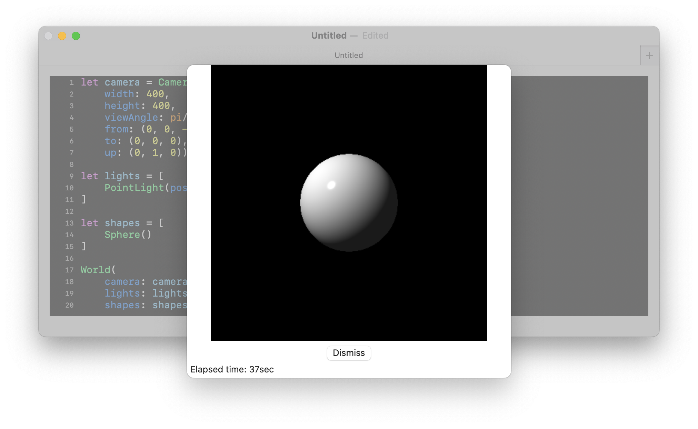
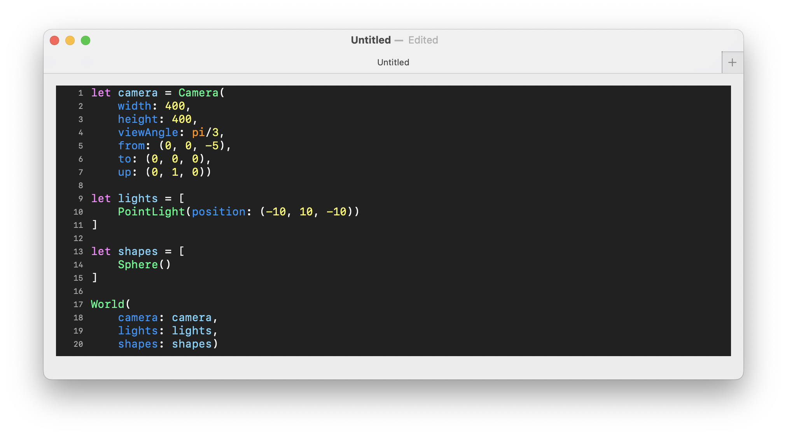
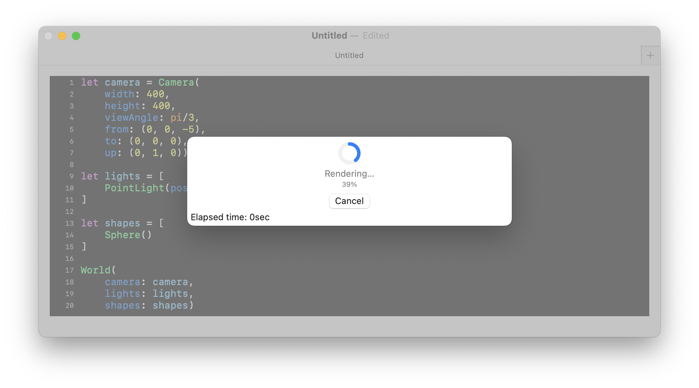

# Purpose

I already had completed work on a ray tracer a while back, namely ScintillaLib... but it bothered me a lot that in order to use it, you needed to:

* Clone my git repo  
* Open it up in Xcode  
* Create a new project importing the package  
* Embed a scene DSL in a SwiftUI app  
* Run the app in Xcode to render the scene  

I _really_ wanted to be able to make something like POV-Ray which is both an editor _and_ runtime environment... but I just didn't have the skillset required to build one of my own on top of my ray tracing library. At that time, I didn't know if it were possible to take a file containing _only_ a subset of Swift code and somehow run it from within Swift, _or_ define my _own_ programming language and be able to run programs expressed in it. But after working on my slox project, an interpreter for a Ruby-like language based on the amazing book, "Crafting Interpreters", by Robert Nystrom, I now know _significantly_ more about how to accomplish the latter. And so, after feeling like I didn't have much more to do with my emulator project and wanting to keep going on something else, I finally decided to take the plunge to create a full-fledged _application_ for my ray tracer. Indeed, quite a few of the techniques used in slox for deisgning a new little programming language, and for tokenizing, parsing, resolving, and executing that code are implemented here.

# Quick start

* Open Scintilla
* Click on the button that says New Document to create a new file, and you should see something like this:


* Fill in the template like the following:

```swift
let camera = Camera(
    width: 400,
    height: 400,
    viewAngle: pi/3,
    from: (0, 0, -5),
    to: (0, 0, 0),
    up: (0, 1, 0))

let lights = [
    PointLight(position: (-10, 10, -10))
]

let shapes = [
    Sphere()
]

World(
    camera: camera,
    lights: lights,
    shapes: shapes)
```

* Go to File... -> Render Scene..., or hit ⌘-R, and wait for the following image to appear:



* Note that you can then go to File -> Export Image..., or hit ⌘-E, to save the image to a local .png file.

# The editor

The application is using the so-called `DocumentGroup` component in SwiftUI and so has baked into it full support for the following features:

* opening multiple files at once
* dialog boxes for opening and saving files
* a "dirty bit" for detecting any changes to a file
* undo and redo

Scintilla's text editor also has syntax highlighting with the following color scheme:

* All object constructors (e.g., `Sphere()`) are in bright green
* All methods (e.g., `translate()`) are in dark green
* All builtin functions (e.g., `sin()`) are in orange
* All builtin constants (at this time just `pi`) are also in orange
* All parameter names are in cadet blue
* All numbers are in yellow
* All punctuation is in white
* Everything else is in light blue



To render a scene described in the currently focused file, go to File... -> Render Scene..., or hit ⌘-R. If there is an error, you will see it displayed in the bottom left of the editor window:


However, if the scene is successfully evaluated, you will get a modal dialog box that first displays a progress meter:



... and then the image when finally rendered:


From there, you can go to File -> Export Image..., or hit ⌘-E, to save the image to a local .png file.

# The language

Scintilla is basically a tiny programming language, where a valid program contains:

* zero or more `let` statements
* zero or more function declarations
* one and _only_ one terminal `World` expression

... and the final `World` expression is the one that is actually rendered.

`let` statements allow you to assign a value to a variable that can be used in another expression, and often allow you to break up a single large expressions into multiple smaller ones. 

```swift
let ball = Sphere()
```

You can also define your own functions for when you find yourself repeating certain code patterns and you want to centralize that logic. A function declaration has the following structure:

* declared with the `func` keyword
* a list of parameter names
* an open brace
* zero or more local `let` statements
* a terminal expression
* a closing brace

For example, the following function takes two parameters, `a` and `b`, and returns their sum:

```swift
func add(a, b) {
    a + b
}
```

User-defined functions can then be invoked by passing values for each parameter following the parameter name, so to call the function above with values 1 and 2, you use `add(a: 1, b: 2)`.

Some Scintilla objects take functions without a name as parameters, called lambdas. They have a similar structure to Scintilla functions:

* an open brace
* a list of parameter names
* the keyword `in`
* zero or more local `let` statements
* a terminal expression
* a closing brace

The `ImplicitSurface` shape is one shape that takes a lambda; this example results in a sphere:

```swift
let ball = ImplicitSurface(
    bottomFrontLeft: (-1, -1, -1),
    topBackRight: (1, 1, 1),
    function: { x, y, z in
        x^2 + y^2 + z^2 - 1
    })
```

It should be noted that at this time declaring and using your own functions can sometimes significantly slow down rendering times, and so you will need to decide what the balance is between performance and readability of your code. This is an open issue that I hope to resolve in the near future.

Scintilla objects, particularly shapes, can also have built-in methods which configure their internal state. To call a method on an object, you instantiate it, followed by a `.`, then the method name, and then the argument list. For instance, to move a a sphere two units to the right, you can do the following:

```swift
let ball = Sphere().translate(x: 2.0, y: 0.0, z: 0.0)
```
... where the value for the `x` parameter is `2.0`, the `y` parameter 0.0, and the `z` parameter 0.0. More detailed discussion of other methods is given below in the Shapes section.

Lists also have two methods for iterating over them, `each()` and `eachWithIndex()`, each of which take a closure to transform each element of the list, the latter of which also includes the index as one of its parameters. As an example, in this code snippet we construct a list of materials representing the solid colors red, green, and blue, then iterate over them to produce a list of `Sphere`s each assigned to a color and also translated a distinct number of units along the x-axis:

```swift
let red = Uniform(Color(r: 1.0, g: 0.0, b: 0.0))
let green = Uniform(Color(r: 0.0, g: 1.0, b: 0.0))
let blue = Uniform(Color(r: 0.0, g: 0.0, b: 1.0))

let colors = [red, green, blue]

let shapes = colors.eachWithIndex({i, color in
    Sphere()
        .material(color)
        .translate(x: i-1, y: 0.0, z: 0.0)
})
```

Scintilla also has support for destructuring of tuples. For example, in the following `let` statement, `a` is assigned to the value 1, `b` to the value 2, and `c` to the value 3:

```swift
let (a, b, c) = (1, 2, 3)
```

You can also destructure nested tuples, like in the following:

```swift
let (a, (b, (c, d))) = (1, (2, (3, 4)))
```

... as well as use wildcard patterns to ignore binding a variable to part of a value:

```swift
let (a, _, c) = (1, 2, 3)
```

In this case, the value 2 is ignored, while `a` and `c` are assigned 1 and 3, respectively.

Function declarations also support destructuring, such as in the following:

```swift
func foo(a, (b, c) as d) {
    a + b + c
}
```

Note that destructured parameters _must_ be aliased at the top level using the `as` keyword.

Lambda expressions also support destructuring but there is no need to alias parameters at the top level.

```swift
someList.each({ (a, b, c) in
    a + b + c
})
```

The language supports most of the primitive types, operators and means of constructing expressions that many other programming languages have, including:

* a boolean type for the few shapes that take them as parameters, whose possible values are `true` and `false`
* a double numeric type; integer literals are cast as doubles
* lists of values, bounded by `[` and `]` with `,` as the delimiter
* tuples of values, bounded by `(` and `)` with `,` as the delimiter
* groupings of subexpressions, bounded by `(` and `)`
* the standard mathematical binary operators, `+`, `-`, `*`, `/`, and `^`
* the unary operator `-` for denoting negative numbers

You can also add comments to your code. They can either be at the end of a line by using two slashes like this:

```swift
let answer = 42 // This is an important variable.
```
... or you can have comments span multiple lines by using `/*` and `*/` like this:

```swift
/*
 * This is the golden ratio.
 */
let φ = 1.61833987
```

For those who are curious, the following is the complete grammar for Scintilla:

```
program        → statement* expression EOF ;
statement      → letDecl
               | funDecl ;
letDecl        → "let" IDENTIFIER "=" expression ;
funDecl        → "func" IDENTIFIER "(" argList ")" "{" letDecl* expression "}" ;
argList        → IDENTIFIER ("," IDENTIFIER)*
expression     → term ;
term           → factor ( ( "-" | "+" ) factor )* ;
factor         → exponent ( ( "/" | "*" ) exponent )* ;
exponent       → unary ( ( "^" unary )* ;
unary          → ( "!" | "-" | "*" ) unary
               | postfix ;
postfix        → primary | method | call ;
method         → postfix "." IDENTIFIER ;
call           → postfix "(" ( (IDENTIFIER ":")? expression)* ")" ;
primary        → tuple
               | grouping
               | list
               | double
               | IDENTIFIER
               | lambda ;
tuple          → "(" expression ( "," expression )* ")" ;
grouping       → "(" expression ")" ;
list           → "[" expression ( "," expression )* "]" ;
lambda         → "{" argList "in" expression "}" ;
```

# Constructing a scene

To construct a scene, you need to create a `World` instance with the following objects:

* one camera
* one or more lights
* one or more shapes

The next several sections go into more detail about the various object types in a Scintilla scene.

## Camera

The construction of a camera requires six pieces of information:

| Parameter name | Description |
| --- | --- |
| `width` | the width of the rendered image in pixels |
| `height` | the height of the rendered image in pixels |
| `viewAngle` | the horizontal viewing angle of the camera in radians |
| `from` | a tuple of `Double`s representing the point in the xyz coordinate system where the camera is located |
| `to` | a tuple of `Double`s representing the point in the xyz coordinate system that the camera is looking at |
| `up` | a tuple of `Double`s representing the _vector_ in the xyz coordinate system designating which way is "up" |

There are also two blurring effects possible with the camera in Scintilla. You can turn on antialiasing to smooth out images. For instance, in the image below, you can see that the various edges of the sphere and its shadow are pretty jagged:


But by using the `antialiasing()` modifier, we can improve its quality:

```swift
let camera = Camera(
    width: 400,
    height: 400,
    viewAngle: pi/3,
    from: (0, 2, -5),
    to: (0, 1, 0),
    up: (0, 1, 0))
    .antialiasing()

let lights = [
    PointLight(position: (-5, 5, -5))
]

let red = Uniform(
    Color(r: 1.0, g: 0.0, b: 0.0))

let shapes = [
    Sphere()
        .translate(x: 0, y: 1, z: 0)
        .material(red),
    Plane()
]

World(
    camera: camera,
    lights: lights,
    shapes: shapes)

```


You can also render images that simulate the effect of an actual camera lens wherein a specific point is in focus and objects that are away from that point are _out_ of focus, being more blurred the further away they are. You can accoomplish this using the `focalBlur()` modifier for `Camera`, which takes three parameters:

* `focalDistance`: the number of units along the ray formed from the `from` and `to` points originally specified in the `Camera` instance. That point along that ray is where the focal point is.
* `aperture`: The radius of the aperture. The larger the size, the more dramatic the blurring effect.
* `samples`: The number of rays cast per pixel from random points on the aperture. The larger the value for `aperture`, the larger the value for `samples` should be in order to minimize the graininess of the effect.

Here is a scene with three spheres with no effect at all:

```swift
let camera = Camera(
    width: 400,
    height: 400,
    viewAngle: pi/3,
    from: (0, 0, -5),
    to: (0, 0, 0),
    up: (0, 1, 0))

let lights = [
    PointLight(position: (-10, 10, -10))
]

let red = Uniform(
    Color(r: 1, g: 0, b: 0))

let green = Uniform(
    Color(r: 0, g: 1, b: 0))

let blue = Uniform(
    Color(r: 0, g: 0, b: 1))

let shapes = [
    Sphere()
        .material(red),
    Sphere()
        .material(green)
        .translate(x: -2.0, y: 0.0, z: 2.0),
    Sphere()
        .material(blue)
        .translate(x: 2.0, y: 0.0, z: 2.0),
    Plane()
        .translate(x: 0, y: -1, z: 0)
]

World(
    camera: camera,
    lights: lights,
    shapes: shapes)
```


... and here is the same scene with focal blur enabled:

```swift
let camera = Camera(
    width: 400,
    height: 400,
    viewAngle: pi/3,
    from: (0, 0, -5),
    to: (0, 0, 0),
    up: (0, 1, 0))
    .focalBlur(focalDistance: 5.0,
               aperture: 0.2,
               samples: 50)

let lights = [
    PointLight(position: (-10, 10, -10))
]

let red = Uniform(
    Color(r: 1, g: 0, b: 0))

let green = Uniform(
    Color(r: 0, g: 1, b: 0))

let blue = Uniform(
    Color(r: 0, g: 0, b: 1))

let shapes = [
    Sphere()
        .material(red),
    Sphere()
        .material(green)
        .translate(x: -2.0, y: 0.0, z: 2.0),
    Sphere()
        .material(blue)
        .translate(x: 2.0, y: 0.0, z: 2.0),
    Plane()
        .translate(x: 0, y: -1, z: 0)
]

World(
    camera: camera,
    lights: lights,
    shapes: shapes)
```

It should be noted that antialiasing is incorporated into the inplementation for focal blur, so there is no need to use both modifiers.


**NOTA BENE** Rendering times are significantly slower with antialiasing or focal blur turned on.

## Lights

Scintilla currently has supports three kinds of lights, each of which is discussed below:

#### `PointLight`

`PointLight` only requires a position, namely a tuple of `Double`s representing the point in the xyz coordinate system where the light source is located, in order to be constructed. Light rays emanate from that single point, and are cast onto the world.

#### `AreaLight`

All of the examples above use `PointLight`, which you can see result in shadows with sharp edges, like the image above. For more realistic shadows, you can use an `AreaLight`. `AreaLight`s require more information in order to be constructed:

| Parameter name | Description |
| --- | --- |
| `corner` | a tuple which represents the x, y, and z coordinates of the corner of the light source |
| `uVector` | a tuple representing a vector whose direction and size comprise one dimension of the light source |
| `uSteps` | the number of subdivisions along the vector defined by `uVector` | 
| `vVector` | a tuple representing a vector whose direction and size comprise the second dimension of the light source |
| `vSteps` | the number of subdivisions along the vector defined by `vVector` | 

The following diagram might make it clearer to understand what the parameters represent:

```
                            --------- vvector -------->

                    ^      ┌------┬------┬------┬------┐
                    |      |      | *    |      |  *   |
                    |      | *    |      |   *  |      |
                    |      ├------┼------┼------┼------┤
                    |      |      |      |  *   |     *|
                 uVector   |    * |  *   |      |      |
                    |      ├------┼------┼------┼------┤
                    |      |      |   *  |   *  |      |
                    |      |  *   |      |      |*     |
                    |      └------┴------┴------┴------┘

                        corner

```

Instead of a single point source of light, an `AreaLight` can be thought of as a quadrilateral one being composed of multiple cells, `uSteps`*`vSteps` in number, each of which contains a distinct source of light whose position is "jittered" from the center of its cell. The diagram above depcits these light sources as asterisks.

For each pixel to be rendered in the scene, a ray is cast from each of the cells' light sources. The colors associated with each light ray are then averaged and assigned to each pixel in the scene, the primary result of which is softer shadows of objects. 

As an example, here is a scene rendered with an area light with 5 subdivisions along each of the two dimensions:

```swift
let camera = Camera(
    width: 400,
    height: 400,
    viewAngle: pi/3,
    from: (0, 2, -5),
    to: (0, 1, 0),
    up: (0, 1, 0))

let lights = [
    AreaLight(
        corner: (-5, 5, -5),
        uVector: (2, 0, 0),
        uSteps: 5,
        vVector: (0, 2, 0),
        vSteps: 5)
]

let red = Uniform(
    Color(r: 1.0, g: 0.0, b: 0.0))

let shapes = [
    Sphere()
        .translate(x: 0, y: 1, z: 0)
        .material(red)
    Plane()
]

World(
    camera: camera,
    lights: lights,
    shapes: shapes)
```


**NOTA BENE**: Using an `AreaLight` results in longer rendering times that are proportional to the values of the `uSteps` and `vSteps` parameters.

#### `SpotLight`

There is also a `SpotLight` available which you can use to illuminate a focused area of the scene; it takes the following parameters:

| Parameter name | Description |
| --- | --- |
| `position` | a tuple which represents the x, y, and z coordinates of the position of the light source |
| `pointAt` | a tuple which represents the x, y, and z coordinates of the point that the light source is directed at |
| `beamAngle` | a double representing the angular width (in radians) of the main beam of light |
| `falloffAngle` | a double representing the angular width of the spotlight over which the intensity of the light falls off to zero. It needs to be greater than or equal to the `beamAngle` value |
| `tightness` | a double which governs the way in which the intensity of the light is attentuated between the `beamAngle` and `falloffAngle`. A value of 1 results in a linear taper; less than one results in a gradual taper at first then a sharp falloff to zero; greater than one results in a rapid taper at first then a gradual falloff to zero |

Below is an example of a scene with a spot light up and to the left of the red ball, which results in the ball's shadow being cast within the elliptical region on the plane illuminated by the spot light:

```swift
let camera = Camera(
    width: 400,
    height: 400,
    viewAngle: pi/3,
    from: (0, 2, -5),
    to: (0, 1, 0),
    up: (0, 1, 0))

let lights = [
    SpotLight(
        position: (-5, 5, -5),
        pointAt: (0, 0, 0),
        beamAngle: pi/24,
        falloffAngle: pi/12,
        tightness: 1)
]

let red = Uniform(
    Color(r: 1, g: 0, b: 0))

let shapes = [
    Sphere()
        .material(red)
        .translate(x: 0, y: 1, z: 0),
    Plane()
]

World(
    camera: camera,
    lights: lights,
    shapes: shapes)

```


You can also have multiple lights, which you can use to create scenes with multiple shadows and/or give shapes more highlights. Below is a slightly different version of the scene above but with _two_ lights, a plane, and the camera moved up a little:

```swift
let camera = Camera(
    width: 400,
    height: 400,
    viewAngle: pi/3,
    from: (0, 2, -5),
    to: (0, 0, 0),
    up: (0, 1, 0))

let lights = [
    PointLight(position: (-10, 10, -10)),
    PointLight(position: (10, 10, -10))
]

let red = Uniform(
    Color(r: 1.0, g: 0.0, b: 0.0))

let shapes = [
    Sphere()
        .material(red),
    Plane()
        .translate(x: 0.0, y: -1.0, z: 0.0)
]

World(
    camera: camera,
    lights: lights,
    shapes: shapes)
```

... and the result is this:


By default, light sources produce white light but you can override that with a color of your choice. In this example, there are three lights in the scene:

```swift
let camera = Camera(
    width: 400,
    height: 400,
    viewAngle: pi/3,
    from: (0, 2, -5),
    to: (0, 0, 0),
    up: (0, 1, 0))

let red = Color(r: 1.0, g: 0.0, b: 0.0)
let green = Color(r: 0.0, g: 1.0, b: 0.0)
let blue = Color(r: 0.0, g: 0.0, b: 1.0)

let lights = [
    PointLight(
        position: (-5, 5, -5),
        color: red),
    PointLight(
        position: (0, 5, -5),
        color: blue),
    PointLight(
        position: (5, 5, -5),
        color: green)
]

let shapes = [
    Sphere(),
    Plane()
        .translate(x: 0.0, y: -1.0, z: 0.0)
]

World(
    camera: camera,
    lights: lights,
    shapes: shapes)
```


Also by default, light intensity does not fade over distance, but if you want a more realistic scene you can specify a value for the `fadeDistance` parameter; larger values mean that light takes more distance to fade, smaller ones result in a sharper dropoff.

```swift
let camera = Camera(
    width: 600,
    height: 600,
    viewAngle: pi/3,
    from: (0, 2, 5),
    to: (0, 0, 0),
    up: (0, 1, 0))

let lights = [
    PointLight(
        position: (5, 5, 5),
        fadeDistance: 5.0)
]

let solidRed = Uniform(
    Color(r: 1.0, g: 0.0, b: 0.0))

let shapes = [
    Sphere()
        .material(solidRed),
    Plane()
        .translate(x: 0.0, y: -1.0, z: 0.0)
]

World(
    camera: camera,
    lights: lights,
    shapes: shapes)
```


## Simple shapes

The following simple geometric shapes are available:

#### `Plane`

The default `Plane` shape lies entirely in the xz-plane. It does not require any parameters in its constructor.

#### `Sphere`

The default `Sphere` is centered at the origin and has radius of one unit. It does not require any parameters in its constructor.


#### `Cube`

The default `Cube` is also entered at the origin and has "radius" of one unit. It does not require any parameters in its constructor.

#### `Cone`

The default `Cone` is centered at the origin, has radius of one unit and infinite length along the y-axis, and has an exposed cap. It also has another constructor which takes three parameters:

* `bottomY`: the value along the y-axis where the cone starts
* `topY`: the value along the y-axis where the cone stops
* `isCapped`: a boolean value turning cap on or off

#### `Cylinder`

Similar to the `Cone`, `Cylinder` is also entered at the origin, has radius of one unit, has infinite length along the y-axis, and has exposed caps. And like the former shape, it can also take the same three parameters in its constructor:

* `bottomY`: the value along the y-axis where the cylinder starts
* `topY`: the value along the y-axis where the cylinder stops
* `isCapped`: a boolean value turning caps on or off

#### `Torus`

The `Torus` is by default centered at the origin, lies in the xz-plane, and has a major radius of two and a minor radius of one. It also takes parameters to override those defaults:

* `majorRadius`: the radius of the circle about which the minor circle is rotated
* `minorRadius`: the radius of the circle rotated about the y-axis

#### `Superellipsoid`

The `Superellipsoid` is centered at the origin, and parameterized by two exponents, `e` and `n` in the equation which governs its shape:

<p align="center">
(|x|<sup>2/e</sup> + |y|<sup>2/e</sup>)<sup>e/n</sup> + z<sup>2/n</sup> = 1
</p>

The shape of the resultant superellipsoid can vary wildly from a rounded cube to a sphere to an octohedron.

## Complex shapes

There are also several more shapes which are a little bit more complex.

#### `SurfaceOfRevolution`

The `SurfaceOfRevolution` is centered at the origin by default and takes the following parameters in its constructor

* `yzPoints`: an array of tuples of Doubles representing the (y, z) coordinates of vertices of the curve to be revolved about the y-axis
* `isCapped`: a boolean value indicating whether or not caps at the top and bottom of the shape should be filled.

This shape is quite useful for making shapes such as vases which have symmetry along a single axis.

```swift
let camera = Camera(
    width: 400,
    height: 400,
    viewAngle: pi/3,
    from: (0, 7, -10),
    to: (0, 2, 0),
    up: (0, 1, 0))

let lights = [
    PointLight(position: (-10, 10, -10))
]

let lavender = Uniform(
    Color(r: 0.5, g: 0.6, b: 0.8))

let shapes = [
    SurfaceOfRevolution(
        yzPoints: [
            (0.0, 2.0), (1.0, 2.0), (2.0, 1.0),
            (3.0, 0.5), (6.0, 0.5)],
        isCapped: false)
        .material(lavender),
    Plane()
]

World(
    camera: camera,
    lights: lights,
    shapes: shapes)
```


#### `Prism`

The `Prism` is somewhat similar to the cylinder in the way that it is constucted; its parameters are:

* `bottomY`: the value along the y-axis where the prism starts
* `topY`: the value along the y-axis where the prism stops
* `xzPoints`: an array of tuples of Doubles representing (x, z) coordinates of the vertices of a polygon

The resulting shape is the polygon defined by the `xzPoints` being extruded from `bottomY` through to `topY` along the y-axis.

```swift
let camera = Camera(
    width: 400,
    height: 400,
    viewAngle: pi/3,
    from: (0, 5, -5),
    to: (0, 1, 0),
    up: (0, 1, 0))

let lights = [
    PointLight(position: (-10, 10, -10))
]

let orange = Uniform(
    Color(r: 1.0, g: 0.5, b: 0.8))

let shapes = [
    Prism(
        bottomY: 0.0,
        topY: 2.0,
        xzPoints: [
            (1.0, 0.0), (1.5, 0.5), (0.5, 0.5),
            (0.0, 1.0), (-0.5, 0.5), (-1.5, 0.5),
            (-1.0, 0.0), (-1.0, -1.0), (0.0, -0.5),
            (1.0, -1.0)])
        .material(orange),
    Plane()
]

World(
    camera: camera,
    lights: lights,
    shapes: shapes)
```


#### `ImplicitSurface`

The `ImplicitSurface` shape is defined by the following equation 

<p align="center">
F(x, y, z) = 0
</p>

and takes the following parameters in its constructor:

* `bottomFrontLeft`: a tuple of doubles representing the the bottom front left point of the bounding box
* `topBackRight`: a tuple of doubles representing the the top back right point of the bounding box
* `function`: the lambda representing F(x, y, z)

Alternatively, you can constuct this shape with the following parameters:

* `center`: the center of the bounding sphere
* `radius`: the radius of the bounding sphere
* `function`: the lambda representing F(x, y, z)

Here is a blob-like shape defined by the equation:

<p align="center">
x² + y² + z² + sin(4x) + sin(4y) + sin(4z) = 1
</p>

```swift
let camera = Camera(
    width: 400,
    height: 400,
    viewAngle: pi/3,
    from: (0, 0, -5),
    to: (0, 0, 0),
    up: (0, 1, 0))

let lights = [
    PointLight(position: (-10, 10, -10))
]

let turquoise = Uniform(
    Color(h: 0.5, s: 0.5, l: 0.5))

let shapes = [
    ImplicitSurface(
        bottomFrontLeft: (-2, -2, -2),
        topBackRight: (2, 2, 2),
        function: { x, y, z in
            x^2 + y^2 + z^2 + sin(4*x) + sin(4*y) + sin(4*z) - 1
        })
        .material(turquoise)
]

World(
    camera: camera,
    lights: lights,
    shapes: shapes)
```


#### `ParametricSurface`

The `ParametricSurface` is a shape defined by the following parameters:

* `bottomFrontLeft`: a tuple of doubles representing the the bottom front left point of the bounding box
* `topBackRight`: a tuple of doubles representing the the top back right point of the bounding box
* `uRange`: a tuple of doubles representing the range of values for the u parameter in the three lambdas below
* `vRange"`: a tuple of doubles representing the range of values for the v parameter in the three lambdas below
* `fx`: a lambda expressing the value of the x coordinate of the surface in terms of u and v
* `fy`: a lambda expressing the value of the y coordinate of the surface in terms of u and v
* `fz`: a lambda expressing the value of the z coordinate of the surface in terms of u and v

```swift
let camera = Camera(
    width: 400,
    height: 400,
    viewAngle: pi/3,
    from: (0, 1, -5),
    to: (0, 0, 0),
    up: (0, 1, 0))

let lights = [
    PointLight(position: (-10, 10, -10))
]

let lightBrown = Uniform(
    Color(h: 0.05, s: 0.7, l: 0.5))

let shapes = [
    ParametricSurface(
        bottomFrontLeft: (-1, -1, -1),
        topBackRight: (1, 1, 1),
        uRange: (0.0, 2*pi),
        vRange: (0.0, 2*pi),
        fx: { u, v in cos(u)*sin(2*v) },
        fy: { u, v in sin(v) },
        fz: { u, v in sin(u)*sin(2*v) })
        .material(lightBrown),
    Plane()
        .translate(x: 0.0, y: -1.0, z: 0.0)    
]

World(
    camera: camera,
    lights: lights,
    shapes: shapes)
```


## Transformations

All shapes can be transformed by calling methods on them.

* `translate(x: Double, y: Double, z: Double)`: moves the shape by the specified anounts in the x, y, and z directions
* `scale(x: Double, y: Double, z: Double)`: makes the shape larger or smaller along the x, y, and z axes
* `rotateX(Double)`: rotates the shape about the x-axis
* `rotateY(Double)`: rotates the shape about the y-axis
* `rotateZ(Double)`: rotates the shape about the z-axis
* `shear(xy: Double, xz: Double, yx: Double, yz: Double, zx: Double, zy: Double)`: deforms the shape by altering the proportion of x with respect to y, proportion of x with respect to z, etc. 

You can chain multiple operations together in a logical manner and not have to explicitly `let` out a transformation matrix incorporating then all, and then pass it in to the shape's constructor. For example,

```swift
let camera = Camera(
    width: 400,
    height: 400,
    viewAngle: pi/3,
    from: (0, 0, -10),
    to: (0, 0, 0),
    up: (0, 1, 0))

let lights = [
    PointLight(position: (-10, 10, -10))
]

let shapes = [
    Cube()
        .shear(xy: 1, xz: 0, yx: 0, yz: 0, zx: 0, zy: 0)
        .scale(x: 1, y: 2, z: 3)
        .rotateX(pi/8)
        .rotateY(pi/8)
        .rotateZ(pi/8)
        .translate(x: 0, y: 1, z: 2),
    Plane()
        .translate(x: 0.0, y: -2.5, z: 0.0)
]

World(
    camera: camers,
    lights: lights,
    shapes: shapes)
```

... results in this:


The implementation applies the underlying transformation matrices in reverse order, so the programmer isn't burdened with those details and instead can simply chain operations in an intuitive manner.

## Materials

`Material`s represent the optical characteristics of shapes. There are currently three distinct categories of materials supported in Scintilla:

* materials with a single uniform color  
* materials with a repeating pattern  
* materials that take three lambdas which map x, y, and z values to the components of a color

All shapes can be constructed with a default material, which among other properties includes the shape's primary color, which is white. You already saw in several of the code snippets above the usage of the `Uniform` material, which is what you can use to specify the color of a shape.

`Color`s are constructed in the RGB color space or the HSL space, using either of the following:

* `Color(r: Double, g: Double, b: Double)`
* `Color(h: Double, s: Double, l: Double)`

A `Uniform` material takes a single parameter, the primary color, and so a red material is constructed like so:

```swift
Uniform(Color(r: 1.0, g: 0.0, b: 0.0))
```

There are several patterns included with Scintilla, each of which takes two colors in their respective constructors:

* `Striped(firstColor: Color, secondColor: Color)`
* `Checkered2D(firstColor: Color, secondColor: Color)`
* `Checkered3D(firstColor: Color, secondColor: Color)`
* `Gradient(firstColor: Color, secondColor: Color)`
* `Marble(firstColor: Color, secondColor: Color)`
* `Wood(firstColor: Color, secondColor: Color)`

The `ColorFunction` material has two constructors, both of which take three lambda functions, one for each of either the RGB or HSL components of the output color:

* `ColorFunction(fr: , fg: , fb:)`
* `ColorFunction(fh: , fs: , fl:)`

Like shapes, patterns can be transformed via method calls and their transformations chained together:

* `translate(x: Double, y: Double, z: Double)`: moves the _pattern_ by the specified anounts in the x, y, and z directions
* `scale(x: Double, y: Double, z: Double)`: makes the _pattern_ larger or smaller along the x, y, and z axes
* `rotateX(Double)`: rotates the _pattern_ about the x-axis
* `rotateY(Double)`: rotates the _pattern_ about the y-axis
* `rotateZ(Double)`: rotates the _pattern_ about the z-axis
* `shear(xy: Double, xz: Double, yx: Double, yz: Double, zx: Double, zy: Double)`: deforms the _pattern_ by altering the proportion of x with respect to y, proportion of x with respect to z, etc. 

Here is an example using most of the material types:

```swift
let camera = Camera(
    width: 400,
    height: 400,
    viewAngle: pi/3,
    from: (0, 4, -7),
    to: (0, 0, 0),
    up: (0, 1, 0))

let lights = [
    PointLight(position: (-10, 10, -10))
]

let solidPurple = Uniform(
    Color(h: 0.8, s: 0.8, l: 0.5))

let checkered = Checkered3D(
    firstColor: Color(r: 1, g: 1, b: 1),
    secondColor: Color(r: 0, g: 0, b: 0))
    .scale(x: 0.5, y: 0.5, z: 0.5)
    .rotateZ(pi/8)

let rainbow = ColorFunction(
    fh: { x, y, z in (arctan2(z, x)+pi)/pi/2.0 },
    fs: { x, y, z in 1.0 },
    fl: { x, y, z in 0.5 })

let pinkMarble = Marble(
    firstColor: Color(r: 1.0, g: 0.75, b: 0.8),
    secondColor: Color(r: 0.2, g: 0.2, b: 0.2))

let brownWood = Wood(
    firstColor: Color(h: 0.08, s: 1.0, l: 0.3),
    secondColor: Color(h: 0.08, s: 1.0, l: 0.1))
    .scale(x: 0.8, y: 0.8, z: 0.8)

let shapes = [
    Sphere()
        .material(solidPurple)
        .translate(x: -3.0, y: 0.0, z: 0.5),
    Sphere()
        .material(checkered)
        .translate(x: 0.0, y: 0.0, z: 2.5),
    Sphere()
        .material(rainbow)
        .translate(x: 3.0, y: 0.0, z: 0.5),
    Sphere()
        .material(pinkMarble)
        .translate(x: 1.5, y: 0.0, z: -2.0),
    Sphere()
        .material(brownWood)
        .translate(x: -1.5, y: 0.0, z: -2.0),
    Plane()
        .translate(x: 0.0, y: -1.0, z: 0.0)
]

World(
    camera: camera,
    lights: lights,
    shapes: shapes)
```


## Constructive solid geometry

There are three supported operations for combining various shapes:

* Union
* Intersection
* Difference

For example, you can construct a die by "subtracting" spheres from a rounded cube like this:

```swift
let camera = Camera(
    width: 400,
    height: 400,
    viewAngle: pi/3,
    from: (0, 3, -7),
    to: (0, 1, 0),
    up: (0, 1, 0))

let lights = [
    PointLight(position: (-5, 10, -10))
]

let white = Uniform(
    Color(r: 1.0, g: 1.0, b: 1.0))

let dimple = 
    Sphere()
        .material(white)
        .scale(x: 0.2, y: 0.2, z: 0.2)

let allDimples = [
    dimple
        .translate(x: 0.0, y: 2.0, z: 0.0),
    dimple
        .translate(x: 1.0, y: 0.5, z: -0.5),
    dimple
        .translate(x: 1.0, y: 1.0, z: 0.0),
    dimple
        .translate(x: 1.0, y: 1.5, z: 0.5),
    dimple
        .translate(x: -0.5, y: 1.5, z: -1.0),
    dimple
        .translate(x: 0.5, y: 0.5, z: -1.0)]

let orange = Uniform(
    Color(h: 0.1, s: 1.0, l: 0.5))

let die = 
    Superellipsoid(e: 0.15, n: 0.15)
        .material(orange)
        .translate(x: 0.0, y: 1.0, z: 0.0)
        .difference(shapes: dimples)
        .rotateY(pi/4)

let plane = Plane()

let shapes = [
    die,
    plane
]

World(
    camera: camera,
    lights: lights,
    shapes: shapes)
```

... to produce an image like so:


You can also chain calls to `.union()`, `.intersection()`, and `.difference()` to create complex shapes:

```swift
let camera = Camera(
    width: 400,
    height: 400,
    viewAngle: pi/3,
    from: (0, 1.5, -3),
    to: (0, 0, 0),
    up: (0, 1, 0))

let lights = [
    PointLight(position: (-10, 10, -10))
]

let red = Uniform(
    Color(r: 1.0, g: 0.0, b: 0.0))

let redCube = [
    Cube()
        .material(red)
        .scale(x: 0.8, y: 0.8, z: 0.8)
]

let green = Uniform(
    Color(r: 0.0, g: 1.0, b: 0.0))

let greenCylinder =
    Cylinder(
        bottomY: -1.0,
        topY: 1.0,
        isCapped: true)
        .material(green)
        .scale(x: 0.5, y: 1.0, z: 0.5)

let greenCylinders = [
    greenCylinder,
    greenCylinder
        .rotateZ(pi/2),
    greenCylinder
        .rotateX(pi/2)
]

let blue = Uniform(
    Color(r: 0.0, g: 0.0, b: 1.0))

let shapes = [
    Sphere()
        .material(blue)
        .intersection(redCube)
        .difference(greenCylinders)
        .rotateY(pi/8)
]

World(
    camera: camera,
    lights: lights,
    shapes: shapes)
```


## Groups

There are times when you do not necessarily want to combine shapes to make new shapes like the above; sometimes you just want to be able to group them together so that they can be moved or otherwise transformed together. For example, if you wanted to take two spheres and rotate them both about each other around the z-axis, you could do this:

```swift
let camera = Camera(
    width: 400,
    height: 400,
    viewAngle: pi/3,
    from: (0, 0, -5),
    to: (0, 0, 0),
    up: (0, 1, 0))

let lights = [
    PointLight(position: (-10, 10, -10))
]

let red = Uniform(
    Color(r: 1.0, g: 0.0, b: 0.0))

let green = Uniform(
    Color(r: 0.0, g: 1.0, b: 0.0))

let twoSpheres = [
    Sphere()
        .material(red)
        .translate(x: -1, y: 0, z: 0)
        .rotateZ(pi/2),
    Sphere()
        .material(green)
        .translate(x: 1, y: 0, z: 0)
        .rotateZ(pi/2)
]

World(
    camera: camera,
    lights: lights,
    shapes: twoSpheres)
```


Notice that we have to apply the same rotation twice. We can do better than this by putting the two spheres in a group and rotate _that_:

```swift
let camera = Camera(
    width: 400,
    height: 400,
    viewAngle: pi/3,
    from: (0, 0, -5),
    to: (0, 0, 0),
    up: (0, 1, 0))

let lights = [
    PointLight(position: (-10, 10, -10))
]

let red = Uniform(
    Color(r: 1.0, g: 0.0, b: 0.0))

let green = Uniform(
    Color(r: 0.0, g: 1.0, b: 0.0))

let twoSpheres = [
    Group([
        Sphere()
            .material(red)
            .translate(x: -1, y: 0, z: 0),
        Sphere()
            .material(green)
            .translate(x: 1, y: 0, z: 0)
    ])
        .rotateZ(pi/2)
]

World(
    camera: camera,
    lights: lights,
    shapes: twoSpheres)
```

It's not a huge gain in this example but if you are constructing scenes with many more objects, you can save a _lot_ of code duplication. 

## Relevant links

* ScintillaLib, the ray tracing library that this app uses  
  [https://github.com/quephird/ScintillaLib](https://github.com/quephird/ScintillaLib)
* slox, an interpreter for a Ruby-like language  
  [https://github.com/quephird/slox](https://github.com/quephird/slox)
* The Ray Tracer Challenge by Jamis Buck  
  [https://pragprog.com/titles/jbtracer/the-ray-tracer-challenge/](https://pragprog.com/titles/jbtracer/the-ray-tracer-challenge/)
* Building a document-based app with SwiftUI  
  [https://developer.apple.com/documentation/swiftui/building-a-document-based-app-with-swiftui](https://developer.apple.com/documentation/swiftui/building-a-document-based-app-with-swiftui)
* Building a text view with syntax highlighting in SwiftUI  
  [https://medium.com/@orhanerday/building-a-swiftui-code-block-view-with-syntax-highlighting-d3d737a90a65](https://medium.com/@orhanerday/building-a-swiftui-code-block-view-with-syntax-highlighting-d3d737a90a65)
* Apple forums thread on how to use a coordinator with a text view  
  [https://forums.developer.apple.com/forums/thread/125920](https://forums.developer.apple.com/forums/thread/125920)
* GitHub repo for example project using `NSRulerView` for displaying line numbers  
  [https://github.com/yichizhang/NSTextView-LineNumberView](https://github.com/yichizhang/NSTextView-LineNumberView)
* Detailed explanation of implementation for Perlin noise  
  [https://adrianb.io/2014/08/09/perlinnoise.html](https://adrianb.io/2014/08/09/perlinnoise.html)
* Nice blog post on how to implement focal blur  
  [https://pathtracing.home.blog/depth-of-field/](https://pathtracing.home.blog/depth-of-field/)