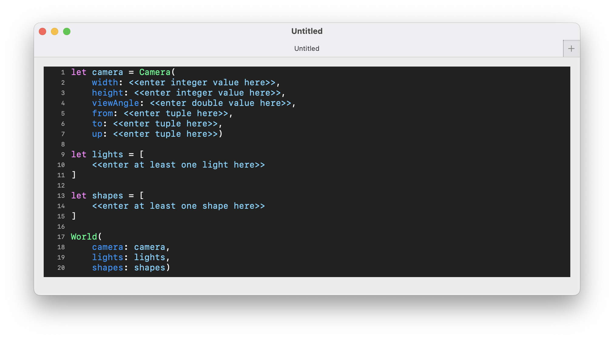

# Purpose

I already had completed work on a ray tracer a while back, namely ScintillaLib... but it bothered me a lot that in order to use it, you needed to:

• Clone my git repo  
• Open it up in Xcode  
• Create a new project importing the package  
• Embed a scene DSL in a SwiftUI app  
• Run the app in Xcode to render the scene  

I _really_ wanted to be able to make something like POV-Ray which is both an editor _and_ runtime environment... but I just didn't have the skillset required to build one of my own on top of my ray tracing library. At that time, I didn't know if it were possible to take a file containing _only_ a subset of Swift code and somehow run it from within Swift, _or_ define my _own_ programming language and be able to run programs expressed in it. But after working on my slox project, an interpreter for a Ruby-like language based on the amazing book, "Crafting Interpreters", by Robert Nystrom, I now know _significantly_ more about how to accomplish the latter. And so, after feeling like I didn't have much more to do with my emulator project and wanting to keep going on something else, I finally decided to take the plunge to create a full-fledged _application_ for my ray tracer. Indeed, quite a few of the techniques used in slox for deisgning a new little programming language, and for tokenizing, parsing, resolving, and executing that code are implemented here.

# Quick start

* Open Scintilla
* Create a new file and add the following code:

```swift
World(
    camera: Camera(
        width: 400,
        height: 400,
        viewAngle: PI/3,
        from: (0, 0, -5),
        to: (0, 0, 0),
        up: (0, 1, 0)),
    lights: [
        PointLight(position: (-10, 10, -10))
    ],
    shapes: [
        Sphere()
    ])
```

* Go to File... -> Render Scene..., or hit ⌘-R, and wait for the following image to appear:



* Note that you can then go to File -> Export Image..., or hit ⌘-E, to save the image to a local .png file.

# The editor

The application is using the so-called `DocumentGroup` component in SwiftUI and so has baked into it full support for the following features:

* opening multiple files at once
* dialog boxes for opening and saving files
* a "dirty bit" for detecting any changes to a file
* undo and redo

Scintilla's text editor also has syntax highlighting with the following color scheme:

* `World` is in orange
* `Camera` is in light blue
* All lights are in sea green
* All shapes are in bright green
* All parameter names are in cadet blue
* All numbers are in yellow
* All punctuation is in white
* Everything else is in purple


To render a scene described in the currently focused file, go to File... -> Render Scene..., or hit ⌘-R. If there is an error, you will see it displayed in the bottom left of the editor window:


However, if the scene is successfully evaluated, you will get a modal dialog box that first displays a progress meter:


... and then the image when finally rendered:


From there, you can go to File -> Export Image..., or hit ⌘-E, to save the image to a local .png file.

# The language

Scintilla is basically a tiny programming language, where a valid program contains:

* zero or more `let` statements
* zero or more function declarations
* one and _only_ one terminal `World` expression

... and the final `World` expression is the one that is actually rendered.

`let` statements allow you to assign a value to a variable that can be used in another expression, and often allow you to break up a single large expressions into multiple smaller ones.

For instance, while you can directly inline the construction of all of the objects listed inside a `World` initializer, like the scene in the "Quick start" section above, it can also be expressed like the following:

```swift
let camera = Camera(
    width: 600,
    height: 600,
    viewAngle: PI/3,
    from: (0, 0, -5),
    to: (0, 0, 0),
    up: (0, 1, 0))

let lights = [
    PointLight(position: (-10, 10, -10))
]

let shapes = [
    Sphere()
]

World(
    camera: camera,
    lights: lights,
    shapes: shapes)
```

As you build more complex scenes, you will find using `let` statements immensely easier to compose and reuse objects, and make your Scintilla programs significantly more readable.

You can also define your own functions for when you find yourself repeating certain code patterns and you want to centralize that logic. A function declaration has the following structure:

* declared with the `func` keyword
* a list of parameter names
* an open brace
* zero or more local `let` statement
* a terminal expression
* a closing brace

User-defined functions are called by passing values for each parameter following the parameter name, so if the function is called `square` and takes a single parameter `n`, then you call it using `square(n: 42)`.

For instance, the implicit equation for the Barth sextic is:

<p align="center">
4(φ²x² - y²)(φ²y² - z²)(φ²z² - x²) - (1 + 2φ)(x² + y² + z² - 1)² = 0
</p>

The first large term has some repeated patterns, namely the difference of squares. You can refactor that subexpresion out into its own function and incorporate it into the main lambda like this:

```
let φ = 1.61833987

func differenceOfSquares(a, b) {
    φ^2*x^2 - y^2
}

let shapes = [
    ImplicitSurface(center: (0.0, 0.0, 0.0),
                    radius: 2.0,
                    function: { x, y, z in 
                        4.0* differenceOfSquares(a: x, b: y)*differenceOfSquares(a: y, b: z)*differenceOfSquares(a: z, b: x) -
                        (1.0 + 2.0*φ) * (x^2 + y^2 + z^2 - 1.0)^2
                    })
        .color(hsl: (0.9, 0.5, 0.5))
]
```

However, it should be noted that at this time declaring and using your own functions can sometimes significantly slow down rendering times, and so you will need to decide what the balance is between performance and readability of your code. This is an open issue that I hope to resolve in the near future.

Scintilla objects, particularly shapes, can also have methods which configure their internal state. To call a method on an object, you instantiate it, followed by a `.`, then the method name, and then the argument list. For instance, to set the color of a sphere to red, you can do the following:

```
let redBall = Sphere().color(rgb: (1, 0, 0))
```
... where the value for the `rgb` parameter is the tuple `(1, 0, 0)` representing the color red. More detailed discussion of other methods is given below in the Shapes section.

The language supports most of the primitive types, operators and means of constructing expressions that many other programming languages have, including:

* a boolean type for the few shapes that take them as parameters, whosw possible values are `true` and `false`
* a double numeric type; integer literals are cast as doubles
* lists of values, bounded by `[` and `]` with `,` as the delimiter
* tuples of values, bounded by `(` and `)` with `,` as the delimiter
* groupings of subexpressions, bounded by `(` and `)`
* the standard mathematical binary operators, `+`, `-`, `*`, `/`, and `^`
* the unary operator `-` for denoting negative numbers

For those who are curious, the following is the complete grammar for Scintilla:

```
program        → statement* expression EOF ;
statement      → letDecl
               | funDecl ;
letDecl        → "let" IDENTIFIER "=" expression ;
funDecl        → "func" IDENTIFIER "(" argList ")" "{" letDecl* expression "}" ;
argList        → IDENTIFIER ("," IDENTIFIER)*
expression     → term ;
term           → factor ( ( "-" | "+" ) factor )* ;
factor         → exponent ( ( "/" | "*" ) exponent )* ;
exponent       → unary ( ( "^" unary )* ;
unary          → ( "!" | "-" | "*" ) unary
               | postfix ;
postfix        → primary | method | call ;
method         → postfix "." IDENTIFIER ;
call           → postfix "(" ( (IDENTIFIER ":")? expression)* ")" ;
primary        → tuple
               | grouping
               | list
               | double
               | IDENTIFIER
               | lambda ;
tuple          → "(" expression ( "," expression )* ")" ;
grouping       → "(" expression ")" ;
list           → "[" expression ( "," expression )* "]" ;
lambda         → "{" argList "in" expression "}" ;
```

You can also add comments to your code. They can either be at the end of a line by using two slashes like this:

```
let answer = 42 // This is an important variable.
```
... or you can have comments span multiple lines by using `/*` and `*/` like this:

```
/*
 * This is the golden ratio.
 */
let φ = 1.61833987
```

# Constructing a scene

To construct a scene, you need to create a `World` instance with the following objects:

* one camera
* one or more lights
* one or more shapes

The next several sections go into more detail about the various object types in a Scintilla scene.

## Camera

The construction of a camera requires six pieces of information:

| Parameter name | Description |
| --- | --- |
| `width` | the width of the rendered image in pixels |
| `height` | the height of the rendered image in pixels |
| `viewAngle` | the horizontal viewing angle of the camera in radians |
| `from` | a tuple of `Double`s representing the point in the xyz coordinate system where the camera is located |
| `to` | a tuple of `Double`s representing the point in the xyz coordinate system that the camera is looking at |
| `up` | a tuple of `Double`s representing the _vector_ in the xyz coordinate system designating which way is "up" |

You can also render a scene with antialiasing by passing in a `true` value to the optional `antialiasing` parameter. In the image below, you can see that the various edges of the object and its shadow are pretty jagged:


But by setting antialiasing to `true`, we can improve its quality:

```
let camera = Camera(
    width: 400,
    height: 400,
    viewAngle: PI/3,
    from: (0, 2, -5),
    to: (0, 1, 0),
    up: (0, 1, 0),
    antialiasing: true)

let lights = [
    PointLight(position: (-5, 5, -5))
]

let shapes = [
    Sphere()
        .translate(x: 0, y: 1, z: 0)
        .color(rgb: (1, 0, 0)),
    Plane()
]

World(
    camera: camera,
    lights: lights,
    shapes: shapes)

```


**NOTA BENE** Rendering times are significantly slower with antialiasing turned on.

## Lights

Scintilla currently supports two kinds of `Light`s, namely `PointLight` and `AreaLight`. `PointLight` only requires a position, namely a tuple of `Double`s representing the point in the xyz coordinate system where the light source is located, in order to be constructed. Light rays emanate from that single point, and are cast onto the world.

The examples above all use `PointLight`, which you can see results in shadows with sharp edges, like the image above. For more realistic shadows, you can use an `AreaLight`. `AreaLight`s require more information in order to be constructed:

| Parameter name | Description |
| --- | --- |
| `corner` | a tuple which represents the x, y, and z coordinates of the corner of the light source |
| `uVector` | a tuple representing a vector whose direction and size comprise one dimension of the light source |
| `uSteps` | the number of subdivisions along the vector defined by `uVector` | 
| `vVector` | a tuple representing a vector whose direction and size comprise the second dimension of the light source |
| `vSteps` | the number of subdivisions along the vector defined by `vVector` | 

The following diagram might make it clearer to understand what the parameters represent:

```
                            --------- vvector -------->

                    ^      ┌------┬------┬------┬------┐
                    |      |      | *    |      |  *   |
                    |      | *    |      |   *  |      |
                    |      |------┼------┼------┼------|
                    |      |      |      |  *   |     *|
                 uVector   |    * |  *   |      |      |
                    |      |------┼------┼------┼------|
                    |      |      |   *  |   *  |      |
                    |      |  *   |      |      |*     |
                    |      └------┴------┴------┴------┘

                        corner

```

Instead of a single point source of light, an `AreaLight` can be thought of as a quadrilateral one being composed of multiple cells, `uSteps`*`vSteps` in number, each of which contains a distinct source of light whose position is "jittered" from the center of its cell. The diagram above depcits these light sources as asterisks.

For each pixel to be rendered in the scene, a ray is cast from each of the cells' light sources. The colors associated with each light ray are then averaged and assigned to each pixel in the scene, the primary result of which is softer shadows of objects. 

As an example, here is a scene rendered with an area light with 5 subdivisions along each of the two dimensions:

```swift
let camera = Camera(
    width: 400,
    height: 400,
    viewAngle: PI/3,
    from: (0, 2, -5),
    to: (0, 1, 0),
    up: (0, 1, 0))

let lights = [
    AreaLight(
        corner: (-5, 5, -5),
        uVector: (2, 0, 0),
        uSteps: 5,
        vVector: (0, 2, 0),
        vSteps: 5)
]

let shapes = [
    Sphere()
        .translate(x: 0, y: 1, z: 0)
        .color(rgb: (1, 0, 0)),
    Plane()
]

World(
    camera: camera,
    lights: lights,
    shapes: shapes)
```


**NOTA BENE**: Using an `AreaLight` results in longer rendering times that are proportional to the values of the `uSteps` and `vSteps` parameters.

You can also have multiple lights, which you can use to create scenes with multiple shadows and/or give shapes more highlights. Below is a slightly different version of the scene above but with _two_ lights, a plane, and the camera moved up a little:

```swift
let camera = Camera(
    width: 400,
    height: 400,
    viewAngle: PI/3,
    from: (0, 2, -5),
    to: (0, 0, 0),
    up: (0, 1, 0))

let lights = [
    PointLight(position: (-10, 10, -10)),
    PointLight(position: (10, 10, -10))
]

let shapes = [
    Sphere()
        .color(rgb: (1, 0, 0)),
    Plane()
        .translate(x: 0.0, y: -1.0, z: 0.0)
]

World(
    camera: camera,
    lights: lights,
    shapes: shapes)
```

... and the result is this:


## Simple shapes

The following simple geometric shapes are available:

#### Plane

The default `Plane` shape lies entirely in the xz-plane. It does not require any parameters in its constructor.

#### Sphere

The default `Sphere` is centered at the origin and has radius of one unit. It does not require any parameters in its constructor.


#### Cube

The default `Cube` is also entered at the origin and has "radius" of one unit. It does not require any parameters in its constructor.

#### Cone

The default `Cone` is centered at the origin, has radius of one unit and infinite length along the y-axis, and has an exposed cap. It also has another constructor which takes three parameters:

* `bottomY`: the value along the y-axis where the cone starts
* `topY`: the value along the y-axis where the cone stops
* `isCapped`: a boolean value turning cap on or off

#### Cylinder

Similar to the `Cone`, `Cylinder` is also entered at the origin, has radius of one unit, has infinite length along the y-axis, and has exposed caps. And like the former shape, it can also take the same three parameters in its constructor:

* `bottomY`: the value along the y-axis where the cylinder starts
* `topY`: the value along the y-axis where the cylinder stops
* `isCapped`: a boolean value turning caps on or off

#### Torus

The `Torus` is by default centered at the origin, lies in the xz-plane, and has a major radius of two and a minor radius of one. It also takes parameters to override those defaults:

* `majorRadius`: the radius of the circle about which the minor circle is rotated
* `minorRadius`: the radius of the circle rotated about the y-axis

#### Superellipsoid

The `Superellipsoid` is centered at the origin, and parameterized by two exponents, `e` and `n` in the equation which governs its shape:

<p align="center">
(|x|<sup>2/e</sup> + |y|<sup>2/e</sup>)<sup>e/n</sup> + z<sup>2/n</sup> = 1
</p>

The shape of the resultant superellipsoid can vary wildly from a rounded cube to a sphere to an octohedron.

## Complex shapes

There are also several more shapes which are a little bit more complex.

#### Surface of revolution

The `SurfaceOfRevolution` is centered at the origin by default and takes the following parameters in its constructor

* `yzPoints`: an array of tuples of Doubles representing the (y, z) coordinates of vertices of the curve to be revolved about the y-axis
* `isCapped`: a boolean value indicating whether or not caps at the top and bottom of the shape should be filled.

This shape is quite useful for making shapes such as vases which have symmetry along a single axis.

```swift
let camera = Camera(
    width: 400,
    height: 400,
    viewAngle: PI/3,
    from: (0, 7, -10),
    to: (0, 2, 0),
    up: (0, 1, 0))

let lights = [
    PointLight(position: (-10, 10, -10))
]

let shapes = [
    SurfaceOfRevolution(
        yzPoints: [
            (0.0, 2.0), (1.0, 2.0), (2.0, 1.0),
            (3.0, 0.5), (6.0, 0.5)],
        isCapped: false)
        .color(rgb: (0.5, 0.6, 0.8)),
    Plane()
        .color(rgb: (1, 1, 1))
]

World(
    camera: camera,
    lights: lights,
    shapes: shapes)
```


#### Prism

The `Prism` is somewhat similar to the cylinder in the way that it is constucted; its parameters are:

* `bottomY`: the value along the y-axis where the prism starts
* `topY`: the value along the y-axis where the prism stops
* `xzPoints`: an array of tuples of Doubles representing (x, z) coordinates of the vertices of a polygon

The resulting shape is the polygon defined by the `xzPoints` being extruded from `bottomY` through to `topY` along the y-axis.

```swift
let camera = Camera(
    width: 400,
    height: 400,
    viewAngle: PI/3,
    from: (0, 5, -5),
    to: (0, 1, 0),
    up: (0, 1, 0))

let lights = [
    PointLight(position: (-10, 10, -10))
]

let shapes = [
    Prism(
        bottomY: 0.0,
        topY: 2.0,
        xzPoints: [
            (1.0, 0.0), (1.5, 0.5), (0.5, 0.5),
            (0.0, 1.0), (-0.5, 0.5), (-1.5, 0.5),
            (-1.0, 0.0), (-1.0, -1.0), (0.0, -0.5),
            (1.0, -1.0)])
        .color(rgb: (1, 0.5, 0)),
    Plane()
        .color(rgb: (1, 1, 1))
]

World(
    camera: camera,
    lights: lights,
    shapes: shapes)
```


#### Implicit surface

The `ImplicitSurface` shape is defined by the following equation 

<p align="center">
F(x, y, z) = 0
</p>

and takes the following parameters in its constructor:

* `bottomFrontLeft`: a tuple of doubles representing the the bottom front left point of the bounding box
* `topBackRight`: a tuple of doubles representing the the top back right point of the bounding box
* `function`: the lambda representing F(x, y, z)

Alternatively, you can constuct this shape with the following parameters:

* `center`: the center of the bounding sphere
* `radius`: the radius of the bounding sphere
* `function`: the lambda representing F(x, y, z)

Here is a blob-like shape defined by the equation:

<p align="center">
x² + y² + z² + sin(4x) + sin(4y) + sin(4z) = 1
</p>

```swift
let camera = Camera(
    width: 400,
    height: 400,
    viewAngle: PI/3,
    from: (0, 0, -5),
    to: (0, 0, 0),
    up: (0, 1, 0))

let lights = [
    PointLight(position: (-10, 10, -10))
]

let shapes = [
    ImplicitSurface(bottomFrontLeft: (-2, -2, -2),
                    topBackRight: (2, 2, 2),
                    function: { x, y, z in 
                        x^2 + y^2 + z^2 + sin(4*x) + sin(4*y) + sin(4*z) - 1
                    })
        .color(hsl: (0.5, 0.5, 0.5))
]

World(
    camera: camera,
    lights: lights,
    shapes: shapes)
```


#### Parametric surface

The `ParametricSurface` is a shape defined by the following parameters:

* `bottomFrontLeft`: a tuple of doubles representing the the bottom front left point of the bounding box
* `topBackRight`: a tuple of doubles representing the the top back right point of the bounding box
* `uRange`: a tuple of doubles representing the range of values for the u parameter in the three lambdas below
* `vRange"`: a tuple of doubles representing the range of values for the v parameter in the three lambdas below
* `fx`: a lambda expressing the value of the x coordinate of the surface in terms of u and v
* `fy`: a lambda expressing the value of the y coordinate of the surface in terms of u and v
* `fz`: a lambda expressing the value of the z coordinate of the surface in terms of u and v

```swift
let camera = Camera(
    width: 400,
    height: 400,
    viewAngle: PI/3,
    from: (0, 1, -5),
    to: (0, 0, 0),
    up: (0, 1, 0))

let lights = [
    PointLight(position: (-10, 10, -10))
]

let shapes = [
    ParametricSurface(
        bottomFrontLeft: (-1, -1, -1),
        topBackRight: (1, 1, 1),
        uRange: (0.0, 2*PI),
        vRange: (0.0, 2*PI),
        fx: { u, v in cos(u)*sin(2*v) },
        fy: { u, v in sin(v) },
        fz: { u, v in sin(u)*sin(2*v) })
        .color(hsl: (0.05, 0.7, 0.5)),
    Plane()
        .translate(x: 0.0, y: -1.0, z: 0.0)    
]

World(
    camera: camera,
    lights: lights,
    shapes: shapes)
```


## Transformations

All shapes can be transformed by calling methods on them.

* `translate(x: Double, y: Double, z: Double)`: moves the shape by the specified anounts in the x, y, and z directions
* `scale(x: Double, y: Double, z: Double)`: makes the shape larger or smaller along the x, y, and z axes
* `rotateX(theta: Double)`: rotates the shape about the x-axis
* `rotateY(theta: Double)`: rotates the shape about the y-axis
* `rotateZ(theta: Double)`: rotates the shape about the z-axis
* `shear(xy: Double, xz: Double, yx: Double, yz: Double, zx: Double, zy: Double)`: deforms the shape by altering the proportion of x with respect to y, proportion of x with respect to z, etc. 

You can chain multiple operations together in a logical manner and not have to explicitly `let` out a transformation matrix incorporating then all, and then pass it in to the shape's constructor. For example,

```swift
let camera = Camera(
    width: 400,
    height: 400,
    viewAngle: PI/3,
    from: (0, 0, -10),
    to: (0, 0, 0),
    up: (0, 1, 0))

let lights = [
    PointLight(position: (-10, 10, -10))
]

let shapes = [
    Cube()
        .shear(xy: 1, xz: 0, yx: 0, yz: 0, zx: 0, zy: 0)
        .scale(x: 1, y: 2, z: 3)
        .rotateX(theta: PI/8)
        .rotateY(theta: PI/8)
        .rotateZ(theta: PI/8)
        .translate(x: 0, y: 1, z: 2),
    Plane()
        .translate(x: 0.0, y: -2.5, z: 0.0)
]

World(
    camera: camers,
    lights: lights,
    shapes: shapes)
```

... results in this:


The implementation applies the underlying transformation matrices in reverse order, so the programmer isn't burdened with those details and instead can simply chain operations in an intuitive manner.

## Materials

All shapes are constructed with a default material, which among other properties includes the shape's color, which is white. At this time, the only default attribute that can be overridden is the shape's color, and only solid colors are supported. You can specify colors in either the RGB or HSL space by calling either of these two methods on a shape:

* `.color(rgb: (Double, Double, Double))`
* `.color(hsl: (Double, Double, Double))`

Setting of other material properties, including patterns, are coming soon!

## Constructive solid geometry

There are three supported operations for combining various shapes:

* Union
* Intersection
* Difference

For example, you can construct a die by "subtracting" spheres from a rounded cube like this:

```
let camera = Camera(
    width: 400,
    height: 400,
    viewAngle: PI/3,
    from: (0, 3, -7),
    to: (0, 1, 0),
    up: (0, 1, 0))

let lights = [
    PointLight(position: (-5, 10, -10))
]

let dimple = 
    Sphere()
        .color(rgb: (1.0, 1.0, 1.0))
        .scale(x: 0.2, y: 0.2, z: 0.2)

let allDimples = [
    dimple
        .translate(x: 0.0, y: 2.0, z: 0.0),
    dimple
        .translate(x: 1.0, y: 0.5, z: -0.5),
    dimple
        .translate(x: 1.0, y: 1.0, z: 0.0),
    dimple
        .translate(x: 1.0, y: 1.5, z: 0.5),
    dimple
        .translate(x: -0.5, y: 1.5, z: -1.0),
    dimple
        .translate(x: 0.5, y: 0.5, z: -1.0)]

let die = 
    Superellipsoid(e: 0.15, n: 0.15)
        .color(hsl: (0.1, 1.0, 0.5))
        .translate(x: 0.0, y: 1.0, z: 0.0)
        .difference(shapes: dimples)
        .rotateY(theta: PI/4)

let plane =
    Plane()
        .color(rgb: (0.9, 0.9, 0.9))

let shapes = [
    die,
    plane
]

World(
    camera: camera,
    lights: lights,
    shapes: shapes)
```

... to produce an image like so:


You can also chain calls to `.union()`, `.intersection()`, and `.difference()` to create complex shapes:

```swift
let camera = Camera(
    width: 400,
    height: 400,
    viewAngle: PI/3,
    from: (0, 1.5, -3),
    to: (0, 0, 0),
    up: (0, 1, 0))

let lights = [
    PointLight(position: (-10, 10, -10))
]

let redCube =
    Cube()
        .color(rgb: (1, 0, 0))
        .scale(x: 0.8, y: 0.8, z: 0.8)

let greenCylinder =
    Cylinder(bottomY: -1.0,
             topY: 1.0,
             isCapped: true)
        .color(rgb: (0, 1, 0))
        .scale(x: 0.5, y: 1.0, z: 0.5)

let greenCylinders = [
    greenCylinder,
    greenCylinder
        .rotateZ(theta: PI/2),
    greenCylinder
        .rotateX(theta: PI/2)
]

let shapes = [
    Sphere()
        .color(rgb: (0, 0, 1))
        .intersection(shapes: [redCube])
        .difference(shapes: greenCylinders)
        .rotateY(theta: PI/8)
]

World(
    camera: camera,
    lights: lights,
    shapes: shapes)
```


## Groups

There are times when you do not necessarily want to combine shapes to make new shapes like the above; sometimes you just want to be able to group them together so that they can be moved or otherwise transformed together. For example, if you wanted to take two spheres and rotate them both about each other around the z-axis, you could do this:

```swift
let camera = Camera(
    width: 400,
    height: 400,
    viewAngle: PI/3,
    from: (0, 0, -5),
    to: (0, 0, 0),
    up: (0, 1, 0))

let lights = [
    PointLight(position: (-10, 10, -10))
]

let twoSpheres = [
    Sphere()
        .color(rgb: (1, 0, 0))
        .translate(x: -1, y: 0, z: 0)
        .rotateZ(theta: PI/2),
    Sphere()
        .color(rgb: (0, 1, 0))
        .translate(x: 1, y: 0, z: 0)
        .rotateZ(theta: PI/2)
]

World(
    camera: camera,
    lights: lights,
    shapes: twoSpheres)
```


Notice that we have to apply the same rotation twice. We can do better than this by putting the two spheres in a group and rotate _that_:

```swift
let camera = Camera(
    width: 400,
    height: 400,
    viewAngle: PI/3,
    from: (0, 0, -5),
    to: (0, 0, 0),
    up: (0, 1, 0))

let lights = [
    PointLight(position: (-10, 10, -10))
]

let twoSpheres = [
    Group(children: [
        Sphere()
            .color(rgb: (1, 0, 0))
            .translate(x: -1, y: 0, z: 0),
        Sphere()
            .color(rgb: (0, 1, 0))
            .translate(x: 1, y: 0, z: 0)
    ])
        .rotateZ(theta: PI/2)
]

World(
    camera: camera,
    lights: lights,
    shapes: twoSpheres)
```

It's not a huge gain in this example but if you are constructing scenes with many more objects, you can save a _lot_ of code duplication. 

## Relevant links

* ScintillaLib, the ray tracing library that this app uses  
  [https://github.com/quephird/ScintillaLib](https://github.com/quephird/ScintillaLib)
* slox, an interpreter for a Ruby-like language  
  [https://github.com/quephird/slox](https://github.com/quephird/slox)
* The Ray Tracer Challenge by Jamis Buck  
  [https://pragprog.com/titles/jbtracer/the-ray-tracer-challenge/](https://pragprog.com/titles/jbtracer/the-ray-tracer-challenge/)
* Building a document-based app with SwiftUI  
  [https://developer.apple.com/documentation/swiftui/building-a-document-based-app-with-swiftui](https://developer.apple.com/documentation/swiftui/building-a-document-based-app-with-swiftui)
* Building a text view with syntax highlighting in SwiftUI  
  [https://medium.com/@orhanerday/building-a-swiftui-code-block-view-with-syntax-highlighting-d3d737a90a65](https://medium.com/@orhanerday/building-a-swiftui-code-block-view-with-syntax-highlighting-d3d737a90a65)
* Apple forums thread on how to use a coordinator with a text view  
  [https://forums.developer.apple.com/forums/thread/125920](https://forums.developer.apple.com/forums/thread/125920)  